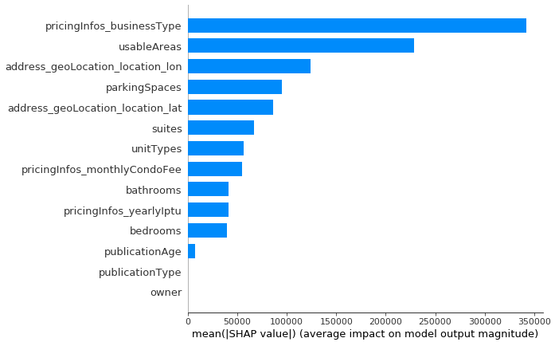

# Grupo ZAP: Data Science Challenge
##### Solução para o desafio proposto em https://grupozap.github.io/cultura/challenges/data-science.html

## Instruções
O notebook com todo o processo, desde importação de dados até resultados do modelo está no [notebook](./code/grupo_zap_challenge.ipynb) dentro da pasta [/code](./code). Lá também se encontra um [arquivo](./code/zap_helpers.py) com funções auxiliares usadas no notebook. Na pasta [/predictions](./predictions) está o arquivo .csv com as previsões da base de treino. A explicação do processo e respostas para as perguntas estão na sequência desse arquivo README.

### Reproducibilidade
Na primeira célula existem algumas constantes. Se o kernel for executado da forma como se encontra, o processo todo vai ser feito sobre amostras dos dados (por causa dos limites de tamanho de arquivo do GitHub). Basta alterar a variável **GET_PARSE_SAVE_DATA** para **True** que os arquivos .zip serão baixados novamente, seguido por um processo de extração e importação dos JSONs originais.

As dependências estão no [requirements.txt](./requirements.txt). A versão do Python utilizada foi a 3.6, e o sistema operacional foi o CentOS 7.

## Etapas
### Análise Exploratória
Para entender os dados, seus tipos, valores, distribuições e correlações, é importante fazer uma análise exploratória. Nessa etapa foi possível validar o processo de conversão do JSON para um DataFrame, identificar variáveis a serem descartadas por motivos distintos (como links para imagens dos imóveis, por exemplo) e avaliar valores que poderiam ser outliers, necessitando de tratamento. Também foi criada uma nova feature calculando o tempo em que o anúncio estava no ar.

### Pré-processamento
Feita a limpeza dos dados e filtro de quais variáveis entrariam para o processo de modelagem, temos a etapa de pré-processamento, preparando os dados para o formato que o modelo aceita. Aqui é feito o input de valores *missing*, usando o valor mais frequente para dados categóricos e o valor da mediana para dados numéricos - a escolha pela mediana se deu por conta da distribuição dos dados, que possui, em geral, caudas muito longas. Também é aqui que a normalização dos dados numéricos e encoding dos dados categóricos são feitas.

### Modelo
O modelo escolhido foi o XGBoost usando árvores de decisão como boosters. A escolha do XGBoost foi pelo histórico de boa performance para dados tabulares. Usar árvores de decisão como booster permite que relações não-lineares sejam capturadas, resultando em um modelo mais ajustado aos dados.
Para ajuste de hiperparâmetros, foi usado o método de *Grid Search*, onde todas as combinações de hiperparâmetros determinados são testados dentro de um processo de validação cruzada, e o melhor modelo é escolhido com base na *Raíz do Erro Quadrático Médio*.

### Avaliação
A métrica de *Raíz do Erro Quadrático Médio* mostra, em média, quanto o valor previsto está distante do valor real. Ela por si só, porém, não diz muito sobre a performance do modelo. Para verificar performance, foram criados dois modelos *dummy*, um que prevê a média e outro que prevê a mediana para todas as observações. O XGBoost ficou aproximadamente 2x melhor que os modelos *dummy*, indicando que de fato houve aprendizado em cima dos dados.

### Limitações
Dada a restrição de tempo para entrega, a solução não fez uso de várias features de texto / imagem / categóricas com alta cardinalidade, que demandam tratamentos mais elaborados e custosos em termos de tempo e recursos computacionais. Uma forma de melhorar a performance seria adicionar esses dados ao XGBoost.

## Respostas
#### Você utilizaria a métrica escolhida para seleção de modelo também para comunicar os resultados para usuários e stakeholders internos? Em caso negativo, qual outra métrica você utilizaria nesse caso?
> Sim, eu utilizaria a métrica escolhida (*Root Mean Squared Error*) para comunicar os resultados, por ser de fácil entendimento e por ter um valor na mesma escala da variável resposta. Também comunicaria a performance com relação aos modelos baseline, para mostrar a dificuldade de encontrar relação nos dados e quanto que o XGBoost melhorou esse processo.

#### Em quais bairros ou em quais faixas de preço o seu modelo performa melhor?
> O modelo performa melhor (com *RMSE* < 4000) nos seguintes bairros:
> - Vila Aurea
> - Vila Babilônia
> - Jardim Sao Francisco (Zona Leste)
> - Jardim São Jorge
> - Jardim
> - Chac. St Antônio
> - Conjunto Residencial Sitio Oratorio
> - Jardim Avenida
> - Balneário São Francisco
> - Cidade Nitro Química

#### Se você tivesse que estimar o valor dos imóveis com apenas 3 campos, quais seriam eles?
> pricingInfos_businessType, usableAreas e address_geoLocation_location_lon
> Essas foram as variáveis que mais contribuíram para o valor das previsões, de acordo com a análise dos valores de SHAP:
> 

#### Como você vislumbra colocar a sua solução em produção?
> Podemos servir o modelo em um Docker, expondo a API para ser consumida pelo front-end na hora de cadastrar os imóveis. Essa solução é simples e permite alta escalabilidade se combinada com um serviço *serverless*, como o *AWS Lambda*, que escala automaticamente o provisionamento de novos servidores rodando o Docker do modelo de acordo com a necessidade.
